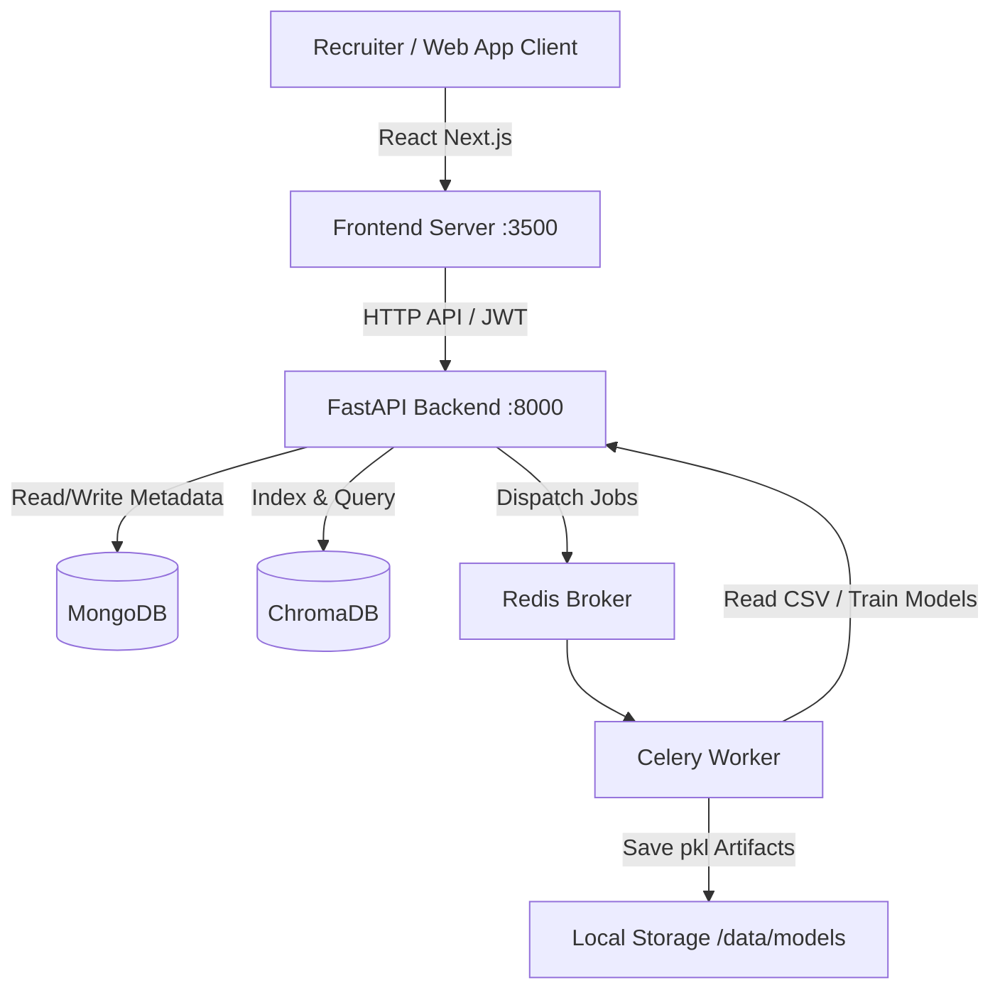

# TalentLens AI — Comprehensive Project & Evaluation Guide

This guide details the complete system architecture, individual features, technical implementation details, and a step-by-step script to showcase the system to your evaluation panel.

---

## 1. System Architecture & Tech Stack

TalentLens AI is built with a decoupled modern architecture:
- **Frontend**: Next.js (React) running on port `3500`, styled with premium Glassmorphism design and Vanilla CSS, utilizing `Framer Motion` for smooth interactive transitions, and `Recharts` for analytics visualization.
- **Backend**: FastAPI running on port `8000`, built with clean asynchronous routing, JWT token auth, rate limiting, and standard middleware.
- **Storage & Vector Indexes**:
  - **MongoDB**: Stores user accounts, candidate metadata, and candidate analysis logs.
  - **ChromaDB**: High-performance vector database used for semantic search indexing and RAG retrieval.
- **Background Task Queue**: Redis (message broker) + Celery (asynchronous worker pool running in `-P solo` mode for Windows compatibility) to decouple heavy tasks (like model training) from API routes.



### New Frontend & Backend API Additions
To bridge the gap between the UI and advanced AI components, we have implemented the following:
*   **Semantic Search Page (`/search`)**: Interfaces with `POST /api/v1/search/semantic`.
*   **Candidate Ranking Page (`/ranking`)**: Interfaces with `POST /api/v1/ranking/rank-candidates`.
*   **AI Recruiter Assistant Page (`/rag`)**: Interfaces with `POST /api/v1/rag/analyze`.
*   **Candidate Detail Retrieval API**: Added `GET /api/v1/data/history/{candidate_id}` to retrieve raw text and metadata dynamically for comparisons.

---

## 2. Core Features: What They Do & How They Work

### 🚀 Feature 1: OCR-Aware Document Intelligence
*   **What it does**: Parses uploaded resume files (PDF, DOCX, and common images like PNG/JPG) and extracts the raw text.
*   **How it works**:
    1. The backend inspects the file MIME type.
    2. For standard text-based PDFs and DOCX, it extracts text directly using lightweight python packages.
    3. For scanned PDFs (where text is flattened into an image) and image resumes, it triggers an **OCR Fallback** pipeline using `PyTesseract`.
    4. It calculates extraction confidence and returns pages processed and latency metrics.

### 📊 Feature 2: Explainable ATS Scoring Engine
*   **What it does**: Measures how suitable a candidate's resume is for a specific job description.
*   **How it works**:
    1. **Keyword Overlap**: Tokenizes both the resume and the job description, filtering out words under 3 characters. It calculates overlapping keywords and lists missing keywords.
    2. **Classifier Prediction**: The resume text is passed to an offline-trained Machine Learning model which predicts the job category (e.g. *Web Designing*, *Java Developer*) and outputs its prediction confidence.
    3. **Weighted Scoring**: Combines the keyword overlap score (68% weight) and the ML classifier confidence (32% weight) to produce a unified ATS Suitability Score (0-100).

### 🤖 Feature 3: Multi-Agent AI Evaluation (CrewAI + Gemini)
*   **What it does**: Provides deep multi-signal analysis of candidate suitability: summarization, skill gap prioritizing, and fairness/bias checks.
*   **How it works**:
    1. If `GOOGLE_API_KEY` is present in the `.env` configuration, the backend boots up **three specialized CrewAI agents**:
       - **Resume Analyzer**: Reads raw text to extract a concise factual summary, key strengths, and top experiences.
       - **Skill Gap Specialist**: Compares the resume against the job description to output prioritized skill gaps.
       - **Bias Detection Agent**: Checks both the resume and the job description for linguistic bias (e.g. gendered pronouns, ageism, or exclusive requirements) to ensure fair hiring.
    2. If the API key is absent or hits rate limits (like Gemini's daily limit `429`), the pipeline **gracefully falls back to heuristic mode**, showing matching calculations and warnings while storing diagnostic information.

### 🔍 Feature 4: Semantic Candidate Search (`/search`)
*   **What it does**: Allows recruiters to perform natural language searches across all candidate resumes (e.g., *"A senior React developer who knows Kubernetes and Docker"*).
*   **How it works**:
    1. During resume upload, the parsed text is embedded using `all-MiniLM-L6-v2` (384-dimensional dense vectors).
    2. The vector is upserted into a local, persistent **ChromaDB** collection alongside candidate details.
    3. During search, the query is embedded into the same vector space, and ChromaDB computes a **Cosine Similarity** nearest-neighbor query, returning the closest matches.

### 🏆 Feature 5: Multi-Candidate Ranking & Comparison Engine (`/ranking`)
*   **What it does**: Takes a Job Description and ranks multiple candidates side-by-side.
*   **How it works**:
    1. Fetches candidate resume texts using their ID from MongoDB history.
    2. Feeds candidate details to the backend scoring engine which evaluates semantic similarity, keyword matching, exact skill overlap, years of experience, and education levels.
    3. Ranks candidates and generates detailed component score breakdowns, recommendations (e.g., *Strong Match*, *Good Match*), strengths, and missing skills.

### 💬 Feature 6: AI Recruiter Assistant / RAG Chat (`/rag`)
*   **What it does**: Provides a conversational chat interface for recruiters to ask questions about the candidate database.
*   **How it works**:
    1. The query is matched against the ChromaDB vector index to retrieve the most relevant resumes.
    2. The text from these resumes is chunked and compressed to fit prompt limits.
    3. The compressed context is fed into Gemini (`gemini-1.5-flash`) along with system instructions to construct structured responses (summaries, recommended hires, retrieved match scores, and skill gaps).
    4. If the LLM is unavailable, a local vector-similarity heuristic computes the response.

### 📈 Feature 7: Recruiter Analytics & Model Metrics (`/analytics`)
*   **What it does**: Displays the system metrics including category distribution, candidate counts, and the machine learning model's performance metrics (accuracy, precision, recall, F1-scores, and confusion matrix).
*   **How it works**:
    1. Reads the test split from the dataset.
    2. Passes test samples through the vectorizer and ML classifier.
    3. Computes standard classification reports using `scikit-learn` and returns the data to interactive React charts.

### ⚙️ Feature 8: Asynchronous Model Training
*   **What it does**: Retrains the machine learning classification model on the dataset without blocking the web application.
*   **How it works**:
    1. When the recruiter clicks "Train Model" on the analytics page, the FastAPI server dispatches a task to **Celery**.
    2. The Celery worker runs the training pipeline asynchronously (TF-IDF vectorization + SVM/Logistic Regression classification), writes the updated `.pkl` files to local storage, and logs completion.

---

## 3. Step-by-Step UI Evaluation Script (Showcase Routine)

Follow this exact sequence to showcase the system to your evaluator.

### 🎬 Phase 1: Authentication & Dashboard (First Impression)

#### Feature 1: User Registration & Login
*   **Where to click**: Open `http://localhost:3500`. Click the **"Sign up"** link to navigate to `/register`.
*   **Inputs to enter**:
    *   Full Name: `Panel Evaluator`
    *   Email: `panel_evaluator@talentlens.com`
    *   Password: `EvalPassword123!`
*   **Action**: Click **Register**. After the toast notification pops up indicating success, you are redirected to `/login`. Re-enter your credentials and click **Sign In**.
*   **What happens on the screen**: A dark login card with a glowing background. Soft glassmorphic slide-in notifications confirm actions. Redirections occur seamlessly without page flashing.
*   **Recruiter Presentation Script**: 
    > *"We have implemented a fully protected user authentication system. The backend validates user credentials, performs secure password hashing via bcrypt, and issues a JWT token. This token is stored on the client side and evaluated during every API request to protect recruitment directories."*

#### Feature 2: High-Level Analytics Dashboard
*   **Where to click**: You land here automatically on `/dashboard`, or click **"Dashboard"** in the navigation header.
*   **What happens on the screen**: Three premium statistics cards (Total Candidates, Average ATS Score, and Upload Success Rate) slide in with an entrance animation. A responsive bar chart displays candidate counts per category, and a radial donut chart tracks recruitment pipeline funnel statistics.
*   **Recruiter Presentation Script**: 
    > *"Our recruitment dashboard aggregates candidate data directly from MongoDB. It provides recruiters with real-time, high-level metrics on average shortlist suitability, total system throughput, and predicted job categories of incoming applicants."*

---

### 🎬 Phase 2: Resume Upload, ATS, and Multi-Agent AI (Core Tech Showcase)

#### Feature 3: OCR-Aware Resume Upload & Processing
*   **Where to click**: Click **"Upload"** in the header.
*   **Inputs to enter**:
    *   Candidate Name: `John Smith`
    *   Job Description:
        ```text
        We are seeking a senior React developer with 5+ years of experience. Must be proficient in JavaScript, TypeScript, Next.js, Docker, and Kubernetes. Strong background in UI design is a plus.
        ```
    *   Resume File: Drag and drop a sample PDF, DOCX, or scanned PNG/JPG image file.
*   **Action**: Click **Upload and analyze**.
*   **What happens on the screen**: A sleek loading skeleton animation appears showing: *"AI Agent is compiling context and ranking matches..."*. Once completed, the analysis panel slides in.
*   **Recruiter Presentation Script**: 
    > *"The platform has an intelligent OCR-aware document processing pipeline. If a candidate uploads a standard PDF or DOCX, the backend parses text directly. If they upload a scanned image, the system automatically redirects the file to PyTesseract OCR. It evaluates text resolution, counts pages, and displays latency metrics."*

#### Feature 4: Explainable ATS Scoring Engine
*   **Where to click**: Inspect the middle section of the upload results panel.
*   **What happens on the screen**: You will see a radial progress circle displaying the final ATS score (e.g. `74% fit`). Below it, a side-by-side comparison shows green pills for **Matched Keywords** and rose-tinted pills for **Missing Keywords**.
*   **Recruiter Presentation Script**: 
    > *"Our ATS engine is transparent. It calculates suitability by combining keyword overlap density (68% weight) with our ML classification prediction confidence (32% weight). Recruiters see exactly what skills are matched and what requirements are missing."*

#### Feature 5: Multi-Agent AI Suite (CrewAI & Gemini)
*   **Where to click**: Scroll to the bottom of the upload results page.
*   **What happens on the screen**: Interactive cards present the **AI Recommendation Badge** (e.g., *Strong Fit*), an **Agent Summary**, **Prioritized Skill Gaps** (yellow badges), and a **Linguistic Bias & Fairness Check** alerting the recruiter of gendered terms or demographic exclusions.
*   **Recruiter Presentation Script**: 
    > *"This triggers a multi-agent workflow powered by CrewAI. Three specialized agents (the Resume Analyzer, the Skill Gap Specialist, and the Bias Detection Agent) review the raw text. To protect system uptime, if Gemini hits rate limits or the API key is missing, the backend automatically triggers a rule-based fallback heuristic."*

---

### 🎬 Phase 3: Semantic Candidate Search (Contextual Querying)

#### Feature 6: Dense Vector Candidate Search
*   **Where to click**: Click **"Search"** in the header.
*   **Inputs to enter**:
    *   Recruiter Query: `"React developer with database experience who knows CSS"`
    *   Top Matches (K): Slide to `5`
    *   Filter Category: Select `All Categories`
*   **Action**: Click **Search Candidates**.
*   **What happens on the screen**: Candidate cards slide up in order of match percentage. Each card displays the Candidate ID, matching skills, a custom text match explanation, and a collapsible accordion containing the raw text preview snippet.
*   **Recruiter Presentation Script**: 
    > *"Unlike simple keyword searches that fail if a synonym is used, we embed parsed resumes into a 384-dimensional vector space inside ChromaDB using SentenceTransformers. When a recruiter types a query, ChromaDB runs a Cosine Similarity match. This retrieves candidates with database experience even if the resume says 'MongoDB' or 'PostgreSQL' instead of the word 'database'."*

---

### 🎬 Phase 4: Candidate Ranking & Comparison Engine (Batch Evaluation)

#### Feature 7: Multi-Candidate Ranking
*   **Where to click**: Click **"Ranking"** in the header.
*   **Inputs to enter**:
    *   Job Description:
        ```text
        Looking for a web designer skilled in HTML, CSS, and Figma.
        ```
    *   Select Candidates Checklist: Check the boxes for 2 or 3 candidates from your history list.
*   **Action**: Click **Compare & Rank Selected**.
*   **What happens on the screen**: The right-hand column animates to show the list of candidates ranked `#1`, `#2`, and `#3`. Each card presents their fitness recommendation (e.g. *Strong Match*), strengths, and missing skills. Clicking **"Component Score Breakdown"** expands a grid showing their exact sub-scores.
*   **Recruiter Presentation Script**: 
    > *"This allows recruiters to shortlist and rank candidates side-by-side. The backend fetches the raw text from MongoDB using a dedicated detail endpoint and calculates sub-scores for semantic matching, keyword matching, skill overlap, experience years, and education. It then scales and normalizes them for a direct comparison."*

---

### 🎬 Phase 5: AI Recruiter Assistant / RAG Chat (Q&A Interface)

#### Feature 8: Grounded RAG Chat
*   **Where to click**: Click **"AI Assistant"** in the header.
*   **Inputs to enter**: Type: `"Which candidates have React and Docker experience?"` or `"Who is best suited for an IT role?"`
*   **Action**: Press Enter or click **Send**.
*   **What happens on the screen**: A message bubble is added, followed by a typing placeholder. The assistant's response bubble appears containing detailed markdown text, a **Recommended Candidates** card, retrieved fit score charts, and a diagnostics dropdown.
*   **Recruiter Presentation Script**: 
    > *"The AI Assistant uses Retrieval-Augmented Generation (RAG). Instead of asking Gemini questions open-ended, the backend queries ChromaDB, extracts the text of matching resumes, and embeds them directly into the system prompt. This guarantees that the assistant only answers based on the resumes in our database, eliminating AI hallucinations."*

---

### 🎬 Phase 6: Model Analytics & Training (Deep Tech Showcase)

#### Feature 9: Machine Learning Model Diagnostics
*   **Where to click**: Click **"Analytics"** in the header.
*   **What happens on the screen**: A model card displays current evaluation scores (Accuracy, Precision, Recall, and F1-Score). Below, an interactive SVG Confusion Matrix grid displays classification splits with hover tooltips.
*   **Recruiter Presentation Script**: 
    > *"This analytics panel represents the performance metrics of our offline-trained machine learning classifier on the test split. The Confusion Matrix allows us to inspect correct classifications versus misclassifications for each category, validating model transparency."*

#### Feature 10: Asynchronous Celery Model Training
*   **Where to click**: Scroll to the bottom of `/analytics`.
*   **Action**: Click **Re-train Model**.
*   **What happens on the screen**: A toast alert appears: *"Model training initiated in the background"*.
*   **Recruiter Presentation Script**: 
    > *"Because training ML models is CPU-intensive, running it synchronously would freeze the web application. When we trigger retraining, the FastAPI backend dispatches the job to Redis. A Celery background worker processes the TF-IDF vectorization and classification training in the background. The user interface remains fully responsive."*

---

## 4. Key Questions & Answers for Your Evaluation

Be prepared to answer these technical questions during the evaluation:

*   **Q: What machine learning models are you using?**
    *   **A**: We use a TF-IDF (Term Frequency-Inverse Document Frequency) Vectorizer to convert text to numerical features, and train a classification model (like Support Vector Machine or Logistic Regression) to categorize resumes. For deep contextual evaluations, we use pre-trained embedding models (`all-MiniLM-L6-v2`) inside ChromaDB and Gemini-2.0-flash / Gemini-1.5-flash via CrewAI/RAG.
*   **Q: How does the system handle scanned resumes or screenshots?**
    *   **A**: It checks if the text extracted directly from the PDF is empty or low confidence. If so, it converts the PDF pages into images and runs OCR extraction using `PyTesseract`.
*   **Q: Why do you have a Celery worker and Redis?**
    *   **A**: Running model training or processing massive batches of resumes is CPU-heavy. If we did this directly in FastAPI's request-response loop, the server would freeze and timeout. Redis acts as a message broker, and Celery processes these tasks in the background asynchronously.
*   **Q: What is the benefit of using ChromaDB?**
    *   **A**: ChromaDB is a vector database. It allows us to perform semantic search. If a recruiter searches for *"Expert coder"*, standard SQL search would return nothing unless the exact words *"Expert coder"* exist. ChromaDB matches candidates with words like *"Software Developer"* or *"Senior programmer"* because their vectors are close in semantic space.
*   **Q: How does the RAG Recruiter Assistant prevent AI hallucinations?**
    *   **A**: Instead of asking Gemini standard open-ended questions, the RAG pipeline first queries ChromaDB for resumes matching the query. It injects these resumes directly into the model's prompt as context and instructs the model to answer based ONLY on the provided context. If no resumes match, the model states that it cannot find relevant information.
*   **Q: What is the Candidate Ranking Engine's scoring formula?**
    *   **A**: The Candidate Ranking Engine scores candidates by calculating a weighted average of:
        1. **Semantic Text Match (40%)**: Cosine similarity between resume and JD embeddings.
        2. **ATS Keyword Match (25%)**: Percentage of job description keywords present in the resume.
        3. **Skill Profile Match (20%)**: Match rate of candidate's explicit skills list against job keywords.
        4. **Experience Level (10%)**: Extracted years of experience compared to senior targets.
        5. **Education Level (5%)**: Highest degree completed (PhD, MS, BS, etc.).
        This composite score is then normalized between 0-100 across the batch.
