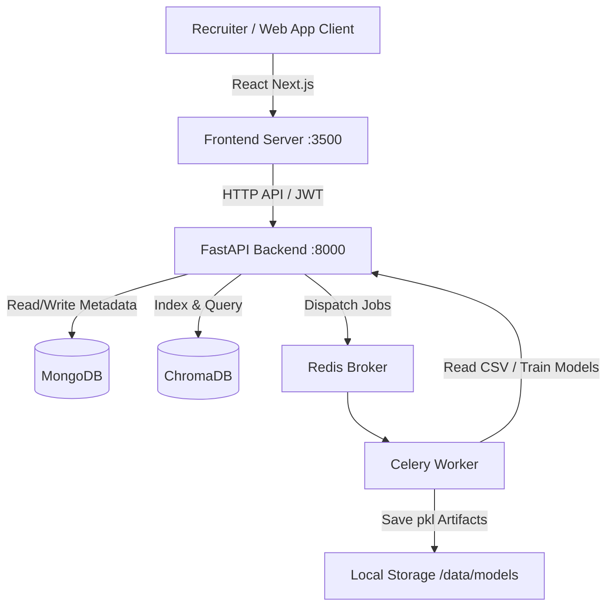

# TalentLens AI — Comprehensive Project & Evaluation Guide

This guide details the complete system architecture, individual features, technical implementation details, and a step-by-step script to showcase the system to your evaluation panel.

---

## 1. System Architecture & Tech Stack

TalentLens AI is built with a decoupled modern architecture:
- **Frontend**: Next.js (React) running on port `3500`, styled with premium Glassmorphism design and Tailwind CSS, utilizing `Framer Motion` for smooth interactive transitions and `Recharts` for analytics visualization.
- **Backend**: FastAPI running on port `8000`, built with clean asynchronous routing, JWT token auth, rate limiting, and standard middleware.
- **Storage & Vector Indexes**:
  - **MongoDB**: Stores user accounts, candidate metadata, and analysis logs.
  - **ChromaDB**: High-performance vector database used for semantic search indexing.
- **Background Task Queue**: Redis (message broker) + Celery (asynchronous worker pool running in `-P solo` mode for Windows compatibility) to decouple heavy tasks (like model training) from API routes.



---

## 2. Core Features: What They Do & How They Work

### 🚀 Feature 1: OCR-Aware Document Intelligence
*   **What it does**: Parses uploaded resume files (PDF, DOCX, and common images like PNG/JPG) and extracts the raw text.
*   **How it works**:
    1. The backend inspects the file MIME type.
    2. For standard text-based PDFs and DOCX, it extracts text directly using lightweight python packages.
    3. For scanned PDFs (where text is flattened into an image) and image resumes, it triggers an **OCR Fallback** pipeline using `PyTesseract`.
    4. It calculates extraction confidence and returns pages processed and latency metrics.

### 📊 Feature 2: Explainable ATS Scoring Engine
*   **What it does**: Measures how suitable a candidate's resume is for a specific job description.
*   **How it works**:
    1. **Keyword Overlap**: Tokenizes both the resume and the job description, filtering out words under 3 characters. It calculates overlapping keywords and lists missing keywords.
    2. **Classifier Prediction**: The resume text is passed to an offline-trained Machine Learning model which predicts the job category (e.g. *Web Designing*, *Java Developer*) and outputs its prediction confidence.
    3. **Weighted Scoring**: Combines the keyword overlap score (68% weight) and the ML classifier confidence (32% weight) to produce a unified ATS Suitability Score (0-100).

### 🤖 Feature 3: Multi-Agent AI Evaluation (CrewAI + Gemini)
*   **What it does**: Provides deep multi-signal analysis of candidate suitability: summarization, skill gap prioritizing, and fairness/bias checks.
*   **How it works**:
    1. If `GOOGLE_API_KEY` is present in the `.env` configuration, the backend boots up **three specialized CrewAI agents**:
       - **Resume Analyzer**: Reads raw text to extract a concise factual summary, key strengths, and top experiences.
       - **Skill Gap Specialist**: Compares the resume against the job description to output prioritized skill gaps.
       - **Bias Detection Agent**: Checks both the resume and the job description for linguistic bias (e.g. gendered pronouns, ageism, or exclusive requirements) to ensure fair hiring.
    2. If the API key is absent or hits rate limits (like Gemini's daily limit `429`), the pipeline **gracefully falls back to heuristic mode**, showing matching calculations and warnings while storing diagnostic information.

### 🔍 Feature 4: Semantic Candidate Search
*   **What it does**: Allows recruiters to perform natural language searches across all candidate resumes (e.g., *"A senior React developer who knows Kubernetes and Docker"*).
*   **How it works**:
    1. During resume upload, the parsed text is embedded using `all-MiniLM-L6-v2` (384-dimensional dense vectors).
    2. The vector is upserted into a local, persistent **ChromaDB** collection alongside candidate details.
    3. During search, the query is embedded into the same vector space, and ChromaDB computes a **Cosine Similarity** nearest-neighbor query, returning the closest matches.

### 📈 Feature 5: Recruiter Analytics & Model Metrics
*   **What it does**: Displays the system metrics including category distribution, candidate counts, and the machine learning model's performance metrics (accuracy, precision, recall, F1-scores, and confusion matrix).
*   **How it works**:
    1. Reads the test split from the dataset.
    2. Passes test samples through the vectorizer and ML classifier.
    3. Computes standard classification reports using `scikit-learn` and returns the data to interactive React charts.

### ⚙️ Feature 6: Asynchronous Model Training
*   **What it does**: Retrains the machine learning classification model on the dataset without blocking the web application.
*   **How it works**:
    1. When the recruiter clicks "Train Model" on the analytics page, the FastAPI server dispatches a task to **Celery**.
    2. The Celery worker runs the training pipeline asynchronously (TF-IDF vectorization + SVM/Logistic Regression classification), writes the updated `.pkl` files to local storage, and logs completion.

---

## 3. Step-by-Step UI Evaluation Script (Showcase Routine)

Follow this exact sequence to showcase the system to your evaluator.

### 🎬 Phase 1: Authentication & Dashboard (First Impression)
1. **Open the web app** at `http://localhost:3500`. You will be redirected to the **Login Page**.
2. **Explain to the panel**: *"The platform uses secure JWT token authentication. We also have a registration system."*
3. Log in with a demo account.
4. Upon logging in, you will land on the **Dashboard** (`/dashboard`).
5. **Showcase**: Point out the modern Glassmorphic theme. Show them the stats cards (Total Candidates, Avg ATS Score, Upload Success Rate) and the candidate breakdown chart.
6. **Explain to the panel**: *"This dashboard aggregates parsed metadata from MongoDB and computes high-level recruiter statistics in real-time."*

### 🎬 Phase 2: Resume Upload, ATS, and Multi-Agent AI (Core Tech Showcase)
1. Navigate to **Upload Intelligence** (`/upload`).
2. **Prepare the inputs**:
   - Enter a Candidate Name: e.g., `Jane Doe`.
   - Enter a Job Description: 
     ```
     We are seeking a senior React developer with 5+ years of experience. Must be proficient in JavaScript, TypeScript, Next.js, Docker, and Kubernetes. Strong background in UI design is a plus.
     ```
3. **Upload a Resume file**: Drag and drop a sample resume PDF, DOCX, or PNG.
4. **Trigger Analysis**: Click **Upload and analyze**.
5. **Explain to the panel during upload**: *"The platform has an OCR-aware parser. If the uploaded resume is a scanned image or screenshot, it will fall back to PyTesseract OCR automatically. You will see page count and extraction confidence in the results."*
6. **Review the core results**:
   - Point out the **ATS score** (e.g. 74/100).
   - Point out the **Matched keywords** and **Missing keywords** (e.g. *Missing: Kubernetes, Docker*).
   - Point out the **Predicted Category** determined by the machine learning model.
7. **Showcase the Multi-Agent AI panel (CrewAI)**:
   - Point out the **Recommendation Badge** (e.g., *Review with recruiter* or *Strong fit*).
   - Read the **Agent Summary**: *"Here, a dedicated CrewAI agent summarized the candidate's core background."*
   - Show the **Skill Gaps** tags (yellow tags): *"The Skill Gap Specialist agent identified that the candidate lacks Docker and Kubernetes."*
   - Show the **Linguistic Bias & Fairness Check**: *"The Bias Detection agent scanned the texts for unfair language. It flagged terms like 'young' or gendered pronouns to help recruiters enforce fair hiring practices."*
   - Expand the **Agent Execution Diagnostics**: *"This shows the underlying execution mode, the latency of each agent (in seconds), and whether the output schema was successfully validated against our JSON schemas."*

### 🎬 Phase 3: Semantic Candidate Search (Semantic Reasoning)
1. Navigate to the **History** or **Search** interface.
2. In the query box, enter a search term: e.g., *"Web designer with frontend experience who knows CSS"*.
3. Click **Search**.
4. **Explain to the panel**: *"Unlike traditional databases that only look for exact keyword matches, our platform embeds the search query using SentenceTransformers and runs a cosine similarity vector search in ChromaDB. It finds resumes that have the same semantic meaning, even if they use different words (like 'styling' instead of 'CSS')."*

### 🎬 Phase 4: Model Analytics & Training (Deep Tech)
1. Navigate to **Analytics** (`/analytics`).
2. Show the ML Model evaluation stats: Point to the **Accuracy**, **Precision**, **Recall**, and **F1-Scores**.
3. Point out the interactive **Confusion Matrix** showing category classifications.
4. Click the **Re-train Model** button.
5. **Explain to the panel**: *"When I trigger a retraining run, the FastAPI server dispatches a task to Redis. A Celery background worker consumes the task and trains our model on the dataset without freezing or blocking our Next.js frontend or backend APIs. The application remains fully responsive."*

---

## 4. Key Questions & Answers for Your Evaluation

Be prepared to answer these technical questions during the evaluation:

*   **Q: What machine learning models are you using?**
    *   **A**: We use a TF-IDF (Term Frequency-Inverse Document Frequency) Vectorizer to convert text to numerical features, and train a classification model (like Support Vector Machine or Logistic Regression) to categorize resumes. For deep contextual evaluations, we use pre-trained embedding models (`all-MiniLM-L6-v2`) inside ChromaDB and Gemini-2.0-flash / Gemini-1.5-flash via CrewAI.
*   **Q: How does the system handle scanned resumes or screenshots?**
    *   **A**: It checks if the text extracted directly from the PDF is empty or low confidence. If so, it converts the PDF pages into images and runs OCR extraction using `PyTesseract`.
*   **Q: Why do you have a Celery worker and Redis?**
    *   **A**: Running model training or processing massive batches of resumes is CPU-heavy. If we did this directly in FastAPI's request-response loop, the server would freeze and timeout. Redis acts as a message broker, and Celery processes these tasks in the background asynchronously.
*   **Q: What is the benefit of using ChromaDB?**
    *   **A**: ChromaDB is a vector database. It allows us to perform semantic search. If a recruiter searches for *"Expert coder"*, standard SQL search would return nothing unless the exact words *"Expert coder"* exist. ChromaDB matches candidates with words like *"Software Developer"* or *"Senior programmer"* because their vectors are close in semantic space.
