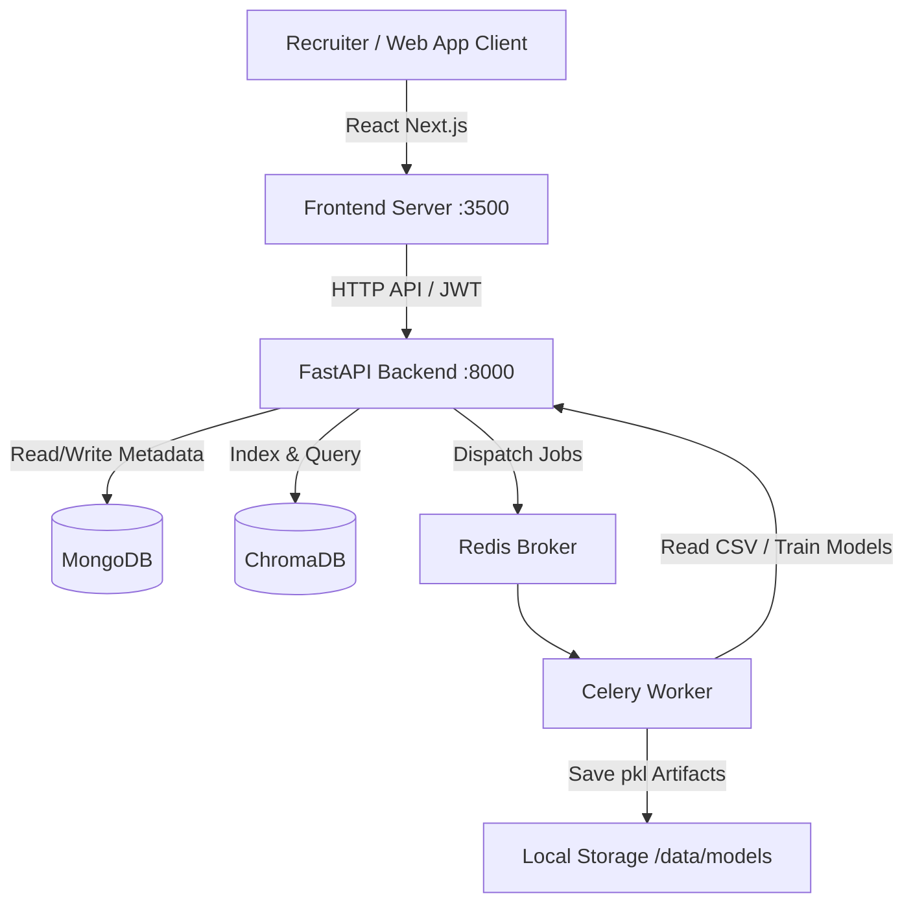

# TalentLens AI (AI Resume Filter)

An AI-powered resume intelligence platform featuring a FastAPI backend and a Next.js frontend. It performs resume classification, computes ATS-style suitability scores, runs semantic candidate search with ChromaDB, and displays a comprehensive recruiter analytics dashboard. Optional CrewAI agents and Gemini-powered RAG add multi-agent reasoning, bias detection, and candidate ranking.

---

## Technical Highlights

- **FastAPI Backend**: Clean architecture with JWT OAuth2 authentication, rate limiting, and robust security middleware.
- **Next.js Frontend**: Responsive Glassmorphism design featuring recruiter dashboards, upload dropzones, and model explainability panels.
- **Semantic Candidate Search (`/search`)**: Dense vectors generated using `all-MiniLM-L6-v2` transformer and stored in a local persistent ChromaDB collection. Features search explanation overlap heuristics.
- **Multi-Candidate Ranking (`/ranking`)**: Ranks shortlists side-by-side based on weighted metrics: semantic similarity (40%), ATS keyword match (25%), skill overlap (20%), experience (10%), and education (5%).
- **RAG Recruiter Assistant (`/rag`)**: Conversational chat interface grounded in ChromaDB resumes utilizing Gemini (`gemini-1.5-flash`) with prompt-token budgeting and heuristic fallbacks.
- **OCR-Aware Document Parser**: Extracts text from PDF, DOCX, and images with automatic fallback to PyTesseract OCR when scanned PDF resumes are uploaded.
- **Explainable ATS Scoring**: Multi-signal scoring engine combining semantic similarity, keyword overlap, skill matching, education levels, and experience.
- **Multi-Agent Evaluation**: Optional CrewAI agent pipelines for in-depth resume summarization, skill gap analysis, and linguistic bias flagging.
- **Async Processing**: Decoupled baseline model training via Celery workers with a Redis message broker.
- **Observability Stack**: Built-in endpoints for Prometheus, Grafana, optional Sentry error tracking, and OpenTelemetry instrumentation.

---

## System Architecture



---

## Quick Start (Local Development)

### Prerequisites
Make sure you have the following services running locally:
- **MongoDB** running on `mongodb://localhost:27017`
- **Redis** running on `redis://localhost:6379`

---

### 1) Backend Service (FastAPI)

1. **Set up the virtual environment and dependencies**:
   ```bash
   python -m venv venv
   venv\Scripts\activate
   pip install -r ai_resume_filter/requirements.txt
   ```

2. **Configure environment variables**:
   Copy the example file to `.env`:
   ```bash
   copy ai_resume_filter\.env.example ai_resume_filter\.env
   ```
   *Verify that `MODEL_PATH` and `VECTORIZER_PATH` point correctly to the relative paths (`../data/models/model.pkl` and `../data/models/vectorizer.pkl` respectively).*

3. **Start the API Server**:
   ```bash
   cd ai_resume_filter
   python -m uvicorn app.main:app --host 127.0.0.1 --port 8000 --reload
   ```
   *The API will be available at: http://127.0.0.1:8000*

4. **Start the Celery Background Worker**:
   Open a separate terminal window and run:
   ```bash
   cd ai_resume_filter
   venv\Scripts\activate
   python -m celery -A app.core.celery_app.celery_app worker -l info -P solo
   ```
   *The `-P solo` pool flag is required for correct execution on Windows systems.*

---

### 2) Frontend Service (Next.js)

1. **Install and launch the dev server**:
   ```bash
   cd frontend
   npm install
   npm run dev -- -p 3500
   ```
   *Note: Port `3500` is used by default because Windows systems reserve standard ports in the `2914-3413` range, causing conflict on port `3000`.*

2. **Open the App**:
   Navigate to **`http://localhost:3500`** in your browser.

---

## Docker Stack Execution

You can run the entire platform within Docker containers using the provided multi-profile Compose file.

### Development Environment (Hot-Reloading)
```bash
docker compose --profile dev up --build
```
*Launches: `backend-dev` (FastAPI with reload), `frontend-dev` (Next.js on port 3001), `worker-dev` (Celery), `mongo`, and `redis`.*

### Production Environment
```bash
copy .env.production.example .env.production
# Edit credentials in .env.production
docker compose --profile prod --env-file .env.production up --build
```
*Launches: `backend` (production Gunicorn), `frontend` (Next.js built), `worker`, `mongo`, `redis`, `postgres`, `prometheus`, `grafana`, `celery-exporter`, and `flower`.*

---

## Offline Data Pipelines & Scripts

You can execute offline scripts for dataset preparation, indexing, or manual training from the `ai_resume_filter` directory:

1. **Inventory Datasets**: Inspects all available CSV, Excel, PDF, and HuggingFace sources:
   ```bash
   python scripts/inventory_datasets.py
   ```
2. **Normalize Data**: Deduplicates and unifies all dataset schemas into a combined file:
   ```bash
   python scripts/normalize_datasets.py
   ```
3. **Build Task Datasets**: Creates model-specific CSV datasets under `data/cache/tasks/`:
   ```bash
   python scripts/data_pipeline.py
   ```
4. **Offline Model Training**: Trains the TF-IDF classifiers on the normalized dataset:
   ```bash
   python scripts/train_model.py
   ```
5. **ChromaDB Indexing**: Embeds the RAG corpus and populates ChromaDB:
   ```bash
   python scripts/index_embeddings.py
   ```

---

## Testing

Run tests locally using:
- **Backend Tests**:
  ```bash
  cd ai_resume_filter
  # Run the full integration audit suite
  python -m pytest tests/test_full_audit.py
  ```
- **Frontend Tests**:
  ```bash
  cd frontend
  npm run test
  ```

---

## Monitoring Links (Docker Profile)

- **Flower (Celery dashboard)**: `http://localhost:5555`
- **Prometheus (Metrics storage)**: `http://localhost:9090`
- **Grafana (Dashboards)**: `http://localhost:3001` *(Default login: admin / admin)*
- **API Documentation**: `http://127.0.0.1:8000/docs`
